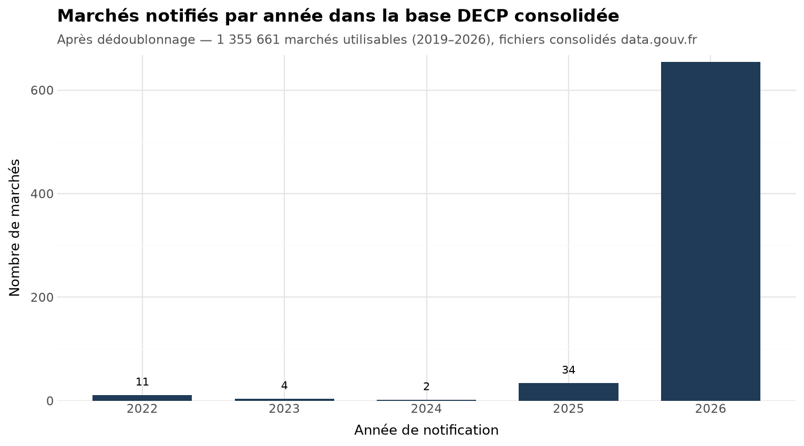
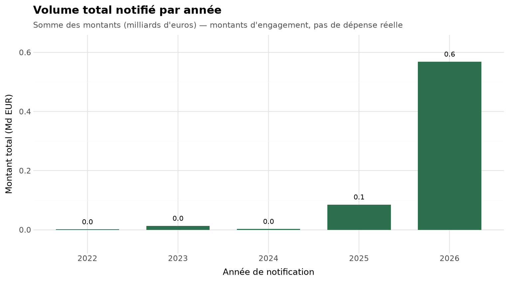
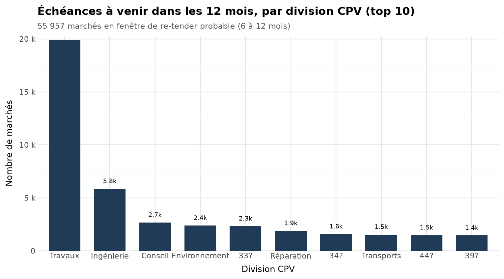

# DECP Radar — analytics on French public procurement

Python (stdlib + pandas), Streamlit, Parquet, cron. Data from data.gouv.fr (Licence Ouverte 2.0). Runs weekly on a home server.

## The problem

Every public contract awarded in France must be published as a DECP notice. The data is open but split across two sources: daily delta files for fresh notices, yearly consolidated files for history. Duplicated records, inconsistent identifiers, and amounts that mean different things per contract type. Any question worth asking — who won what this week, which contracts expire soon — needs a pipeline before it needs analysis.

## What I built

Two repos that work as one product.

decp-digest does ingestion and the weekly digest. Stdlib-only Python: fetches the daily deltas, watermarks on the last processed file, dedupes on (acheteur.id, id) — about 3% of records repeat across consecutive files. Measured over a full validation week: ~750 notices, every field the digest needs at 99.7% fill or better. The README also states what the data cannot support, e.g. publication lags notification by a median of 6 days, so the digest groups by publication date.

decp-analytics rebuilds from the consolidated files (2019–2026), drops superseded records (311,002 dropped, 1,355,661 usable), estimates expiry as dateNotification + dureeMois, and outputs:

- the re-tender window: 55,957 contracts expiring within 12 months, filterable by CPV family, département and buyer;
- a Streamlit dashboard (CPV / département / period filters, KPIs, buyer and supplier views);
- a free 60-row public sample.

A Monday 07:30 cron refreshes both layers. The full rebuild is the only heavy step and fits in the under-2h/week budget.

## From the real data

*Chart 3 — top CPV divisions: 45 construction (19,916), 71 engineering (5,848), 79 consulting (2,658). Division names come from the dataset as published, unmapped ones ("33?") shown as-is.*

All charts come from plotnine on the pipeline's own parquet outputs, and are checked programmatically (text bounding boxes) before publication.

