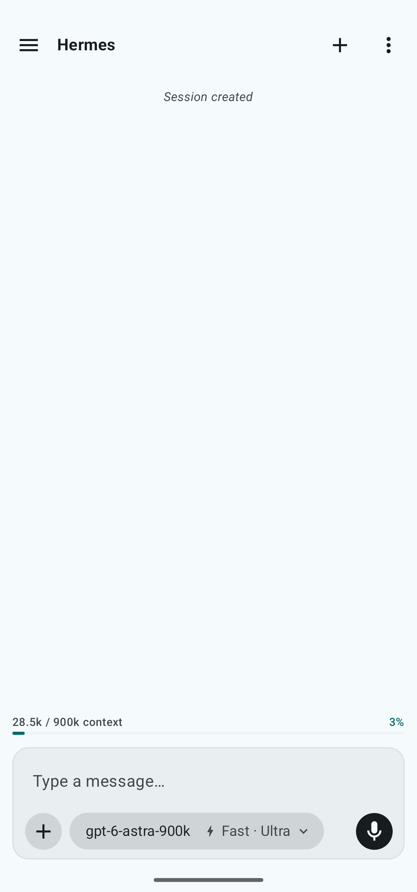
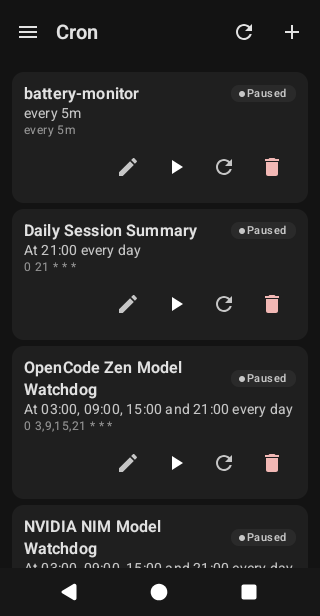
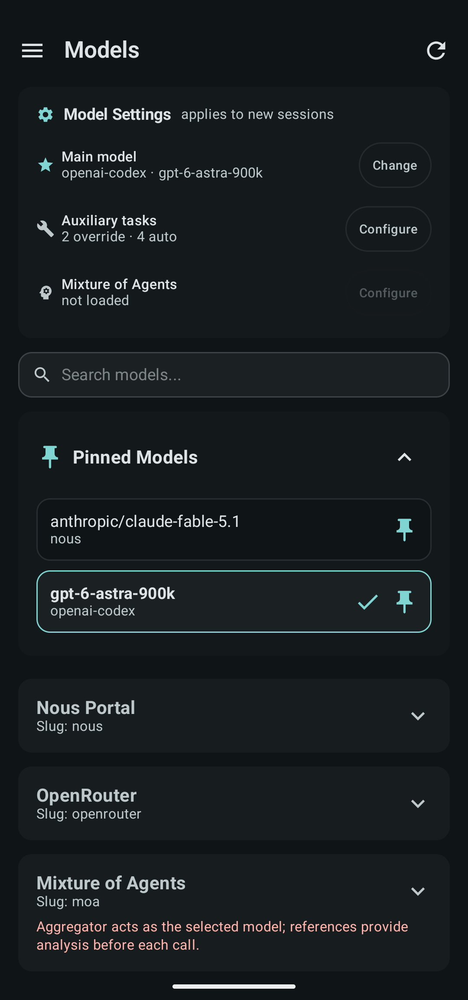
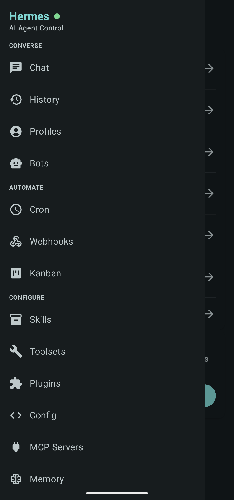

# Sia — control client for a self-hosted Hermes agent

Kotlin, Jetpack Compose, Room, WebSocket JSON-RPC + REST, Gradle CI. Fork of upstream hermes-mobile, hardened and verified on device. A rework is in progress (see below).

## The problem

I run my own Hermes AI agent on a home server. The upstream Android client did not fit how I want to drive the agent from a phone: voice input that behaves predictably, chat history that survives offline, onboarding that assumes you already run Tailscale and Hermes.

So I forked it, renamed it Sia (com.sia.hermescontrol), and hardened it.

## What I built

- A Jetpack Compose app, 30+ screens: chat, cron management, model selection, sidebars, settings. Room holds history so past conversations work offline.
- Transport: WebSocket JSON-RPC to the live agent gateway, REST for CRUD (mailbox, cron, peers).
- Voice, the hard part. The shipped on-device STT engine dead-locked on my devices with no error output; I documented two A/B attempts with the failure signatures, then removed the engine. The final design is push-to-talk, server-side Whisper (small, en-only), transcript fills the compose box — never auto-sent. Three gestures, each tuned: hold 150 ms or more appends, swipe-up sends, drag-left cancels.
- Release engineering: Gradle CI, signed release APKs, F-Droid metadata.
- 2,495 tests passing across units and instrumentation at the last full run.

## Screenshots

## Rework, in progress

The next iteration repositions Sia as "your Tailscale client for Hermes": an onboarding wizard that walks Tailscale API key, node discovery, first connection — instead of asking the user to hand-copy connection settings. The fork relationship is stated openly.

